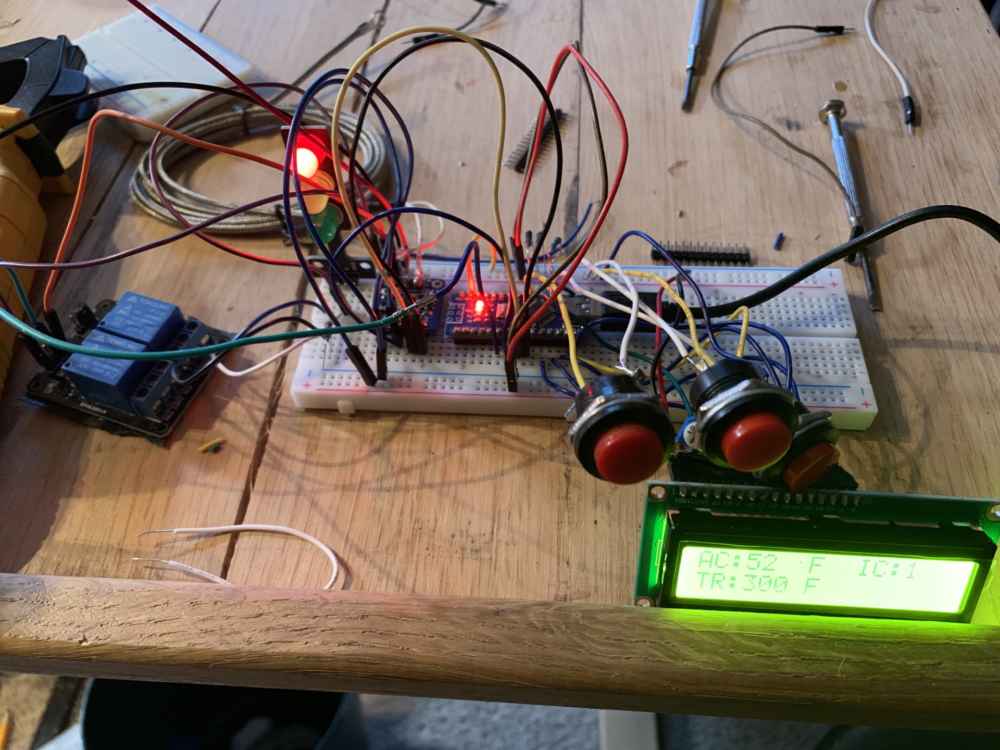

Thermal Relay

Description:

This project is a relay to that flips given a increase over a configured threshold.

Components:

- Arduino Nano
- QAPASS 1602A
- JQC-3FF-S-Z
- MAX6675 & K-Type probe
- Indicator Lights
- 3x 10K resistors

Image of initial Circuit.

